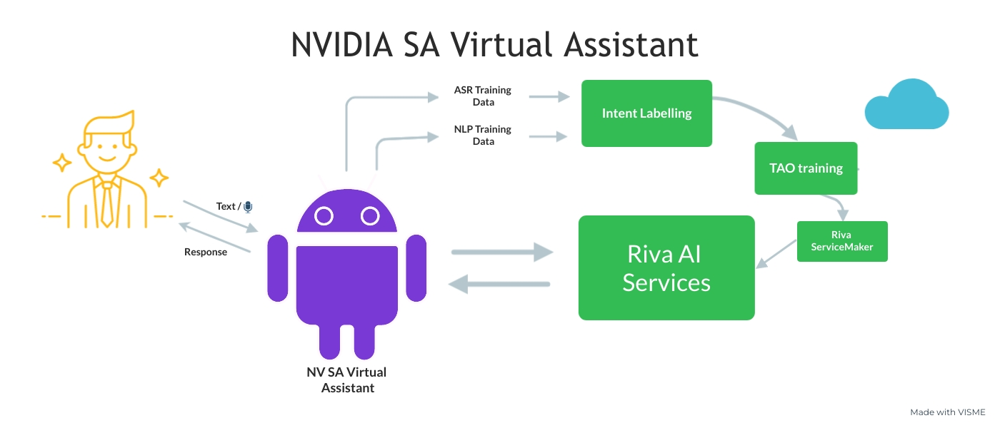

Overview
========

Conversational artificial intelligence (AI) has significantly advanced in recent years in terms of its popularity, scalability, and reliability. Meanwhile, The demands and interests for NVIDIA products and platforms has rapidly increased, such as data centers and SDKs. 

NVIDIA Riva, a GPU-accelerated SDK that simplifies the workflow for building conversational AI applications enables developers to customize robust automatic speech recognition (ASR), natural language processing (NLP), and text-to-speech (TTS) services at a world-class performance. 

Also, Riva incorporates seamless workflow for training, finetuning, and exporting inference engines using NVIDIA TAO Toolkit. Belted with powerful NVIDIA frameworks, NV SA Virtual Assistant, which is designed to be the helping hands for SAs, is created.

