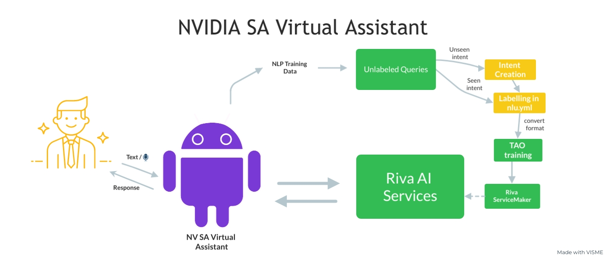

Unseen Intent Handling
======================

It's common for the virtual Assistant to come across with unseen intents, which might fail the queries answering. NVIDIA SA Virtual Assistant collects user queries in tsv format (which is compatible with TAO training format).

dgx_utter.txt
-------------

Take DGX Chatbot frontend implementation :ref:`frontend` as example, the incoming queries to chatbot is stored at :code:`dgxUtter/dgx_utter.txt`.

A sample piece from :file:`dgxUtter/dgx_utter.txt`:

.. code-block:: text

    what is mig?
    pcie?
    network config for dgx
    my fan is broken, how to repair?
    my drive is not working, how to fix

Notice that some of them may be in assistant's capacity, while some do not.

Labelling
---------

Following the TAO Toolkit training format, for each line of :file:`dgxUtter/dgx_utter.txt`, we label them in following syntax :code:`<query><tab><label>`.

There are basically 2 possible cases: first, the label is seen before, then we can label it referring to :file:`labels.csv` previously generated (see :ref:`data_convert`), and add it back in :file:`nlu.yml` or manually append to :file:`train.tsv` or :file:`val.tsv`. 

Otherwise, this is unseen label, then we should 1) create a new intent in :file:`nlu.yml` and pass in the collected query 2) Update :code:`NUM_CLASSES` in :file:`config_chatbot.sh` (see :ref:`train_config`) after adding new intent.

In both cases, if new data is passed into :file:`nlu.yml`, we should re-run :file:`convert_yaml.py` mentioned in :ref:`data_convert` to generate new TAO training files.
