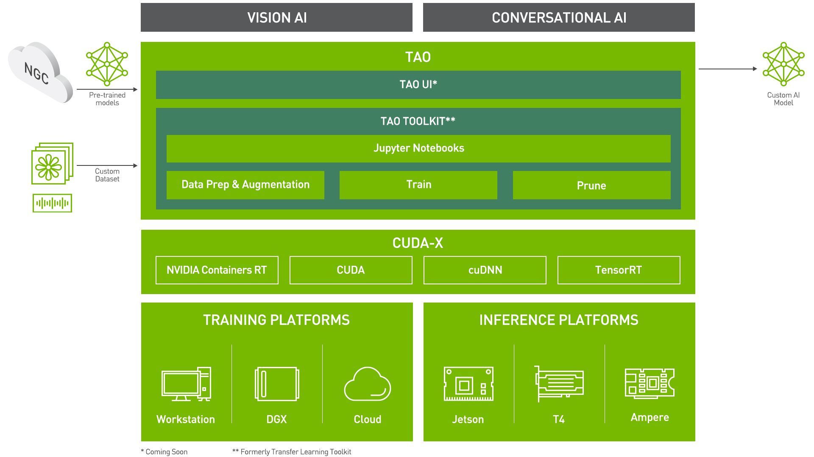

Prerequisites
=============

This section contains the prerequisites for NVIDIA SA Virtual Assistant.

.. note::

    1. Only Linux environment is supported for the instructions below.
    2. You have access to a Volta, Turing, or an NVIDIA Ampere architecture-based GPU.

1. Docker
*********

Docker is required for using containers in NVIDIA GPU Cloud (NGC). According to *opensource.com*, Docker, a subset of the Moby project, is a software framework for building, running, and managing containers on servers and the cloud. The term "docker" may refer to either the tools (the commands and a daemon) or to the Dockerfile file format.

It used to be that when you wanted to run a web application, you bought a server, installed Linux, set up a LAMP stack, and ran the app. If your app got popular, you practiced good load balancing by setting up a second server to ensure the application wouldn't crash from too much traffic.

1.1 Uninstalled old Docker
--------------------------
First, let's remove old Docker if you wish to complete the remaining Docker installation in this page with a fresh start:

.. code-block:: bash

    $ sudo apt-get remove docker docker-engine docker.io containerd runc

1.2 Set up the repository
-------------------------
Update the apt package index and install packages to allow apt to use a repository over HTTPS:

.. code-block:: bash

    $ sudo apt-get update

    $ sudo apt-get install \
        ca-certificates \
        curl \
        gnupg \
        lsb-release

Add Docker's official GPG key:

.. code-block:: bash

    $  curl -fsSL https://download.docker.com/linux/ubuntu/gpg | sudo gpg --dearmor -o /usr/share/keyrings/docker-archive-keyring.gpg

1.3 Install Docker Engine:
--------------------------

.. code-block:: bash

    $ sudo apt-get update
    $ sudo apt-get install docker-ce docker-ce-cli containerd.io

Verify that Docker Engine is installed correctly by running the hello-world image.

.. code-block:: bash

    $ sudo docker run hello-world

This command downloads a test image and runs it in a container. When the container runs, it prints a message and exits.

1.4 NVIDIA Contianer Toolkit
----------------------------
Although we have installed Docker, but we still need the NVIDIA Container toolkit to enable GPUs usage in docker containers. To enable GPUs in Docker containers, we first setup the package repository and the GPG key:

.. code-block:: bash

    $ distribution=$(. /etc/os-release;echo $ID$VERSION_ID) \
      && curl -fsSL https://nvidia.github.io/libnvidia-container/gpgkey | sudo gpg --dearmor -o /usr/share/keyrings/nvidia-container-toolkit-keyring.gpg \
      && curl -s -L https://nvidia.github.io/libnvidia-container/$distribution/libnvidia-container.list | \
            sed 's#deb https://#deb [signed-by=/usr/share/keyrings/nvidia-container-toolkit-keyring.gpg] https://#g' | \
            sudo tee /etc/apt/sources.list.d/nvidia-container-toolkit.list

Now, we can install :code:`nvidia-docker2` package (and dependencies) after updating the package listing

.. code-block:: bash

    $ sudo apt-get update
    $ sudo apt-get install -y nvidia-docker-2

After installing nvidia-docker, we can restart the Docker and verify our installation is correct.

.. code-block:: bash

    $ sudo systemctl restart docker
    $ sudo docker run --rm --gpus all nvidia/cuda:11.0-base nvidia-smi

This should result in a console output about your GPU status.

2. NVIDIA AI Software
*********************

NVIDIA GPU Cloud API
--------------------
NVIDIA GPU Cloud (NGC) is performance-optimized AI/HPC software containers, pre-trained AI models, and Jupyter Notebooks that accelerate AI developments and HPC workloads on any GPU-powered on-prem, cloud, and edge systems. To gain a access to NGC, follow the steps below:

    1. Sign in `NVIDIA NGC  <https://ngc.nvidia.com/>`_. (Sign up an account if you have not.)
    2. Setup `NGC API Key <https://ngc.nvidia.com/setup/api-key>`_ by clicking **Generate API Key** at the top-right corner

    .. image:: _static/css/img/ngcapikey.jpg
        :width: 800
        :alt: Alternative text

    3. Save the API key into a file of your choice. Now let's install `NGC CLI <https://ngc.nvidia.com/setup/installers/cli>`_.

    4. Open a CLI, download, unzip, and install from the command line by moving to a directory where you have execute permissions and then running the following command:

    .. code-block:: bash

        $ wget -O ngccli_linux.zip https://ngc.nvidia.com/downloads/ngccli_linux.zip && unzip -o ngccli_linux.zip && chmod u+x ngc

    5. Check the binary's md5 hash to ensure the file wasn't corrupted during download:

    .. code-block:: bash

        $ md5sum -c ngc.md5

    6. Add your current directory to path:

    .. code-block:: bash

        $ echo "export PATH=\"\$PATH:$(pwd)\"" >> ~/.bash_profile && source ~/.bash_profile

    7. You must configure NGC CLI for your use so that you can run the commands.

    Enter the following command, including your API key when prompted:

    .. code-block:: bash

        $ ngc config set

    Follow the prompts and enter the information. If your login is success, you will see a Login succeed message, and now you should able to pull NVIDIA TAO Toolkit and Riva from NGC!

NVIDIA TAO Toolkit
------------------
The NVIDIA TAO Toolkit is used with NVIDIA pre-trained models to create custom Computer Vision (CV) and Conversational AI models with the user’s own data. Training AI models using TAO Toolkit does not require expertise in AI or deep learning. A simplified Command Line Interface (CLI) abstracts away AI framework complexity enabling users to build production quality AI models using a simple spec file and one of the NVIDIA pre-trained models. 

TAO Toolkit is a Python pip package that is hosted on the NVIDIA PyIndex. The package uses the docker restAPI under the hood to interact with the NGC Docker registry to pull and instantiate the underlying docker containers. To install TAO Toolkit:

.. code-block:: bash

    $ pip3 install nvidia-tao

NVIDIA Riva Skills Quick Start
------------------------------
Download Riva quick start scripts via the command-line with the NGC CLI tool:

.. code:: bash

    $ ngc registry resource download-version "nvidia/riva/riva_quickstart:1.10.0-beta"

You should be able to see a folder :file:`nvidia/riva/riva_quickstart:1.10.0-beta` at the location you run this command.

NVIDIA Riva ServiceMaker
------------------------
Riva ServiceMaker provides handy tools to deploy trained models for Riva AI Services. Pull the container in CLI:

.. code:: bash

    $ docker pull nvcr.io/nvidia/riva/riva-speech:1.10.0-beta-servicemaker

This container will be used in the model deploy stage later.
